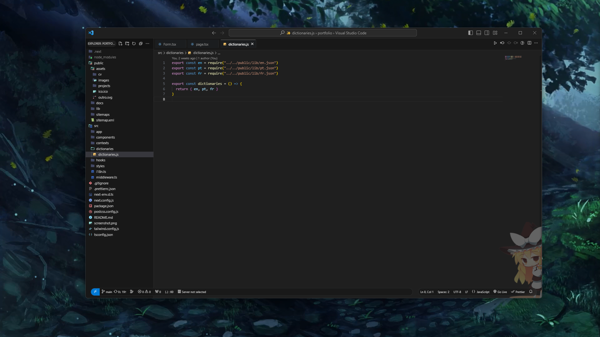

### Minhas configurações pro VSCode

### Requirements
- APC (extensão): Extension ID: drcika.apc-extension
- Material Icons (pacote de icones - extensão): Extension ID: PKief.material-icon-theme

### How to use
- Clone este repositório, copie o conteúdo de settings.json ou apenas baixe o arquivo settings.json
- Localize seus arquivos de configuração do VSCode 
  - No VSCode: Crtl + Shift + P
  - Pesquise por => Preferences: Open User Settings (JSON)
- Subtitua o conteúdo do arquivo que abrir (settings.json) pelo baixado/copiado/clonado 
- Salve e dê um reload no VSCode. Pronto!

### Preview
